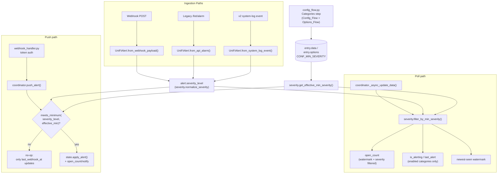

# Design Document

## Overview

This feature adds a per-category **minimum severity filter** on top of the existing category-enable/disable mechanism. Today, enabling a category (e.g. `network_device`) accepts every alert in it regardless of how trivial the underlying event is. This closes the second half of GitHub Issue #135 (the first half, raw severity exposure via the `severity`/`last_severity` attributes, shipped in PR #210 / v1.9.0) by letting a user say "only alert me for `network_device` events at `HIGH` or above" without disabling the category outright.

Three new pieces of behavior are introduced:

1. **Severity_Normalizer** — a pure function that maps the raw, ingestion-path-specific severity string (webhook payload, legacy `/list/alarm` record, or v2 `system-log` event) onto one of exactly four ordered levels: `LOW < MEDIUM < HIGH < VERY_HIGH`. This gives every alert a consistent severity regardless of which of the three ingestion paths produced it.
2. **Minimum_Severity_Setting** — a new per-category config value, `No_Filter < LOW < MEDIUM < HIGH < VERY_HIGH`, configurable in both the initial `Config_Flow` and the `Options_Flow`. `No_Filter` (stored as `"no_filter"`) is a distinct sentinel, not a Severity_Level — it disables the gate entirely for that category.
3. **Severity gating** — both the webhook push path (`push_alert`) and the polling path (`_async_update_data`) consult the effective `Minimum_Severity_Setting` for a category and treat a below-threshold alert as a true no-op: no state change, no event fire, no count increment.

Backward compatibility is structural, not migrational: nothing is written to existing config entries. An entry with no stored `min_severity` map (or one missing a specific category key) resolves to `No_Filter` for that category via the same lookup helper used everywhere else, so every alert a user received before this feature shipped keeps being accepted after upgrade.

## Architecture



Severity normalization and comparison logic is pure and side-effect-free, living in a new `severity.py` module — none of the existing modules (`const.py`, `models.py`, `coordinator.py`) currently own this kind of standalone lookup/comparison logic, and none of the three ingestion paths should each re-implement it. `const.py` gains only the new config key and the raw severity synonym table lives alongside the normalizer in `severity.py` rather than `const.py`, since it is exclusively consumed by, and documented next to, `normalize_severity()`.

## Components and Interfaces

### `severity.py` (new module)

```python
SEVERITY_LOW: Final = "LOW"
SEVERITY_MEDIUM: Final = "MEDIUM"
SEVERITY_HIGH: Final = "HIGH"
SEVERITY_VERY_HIGH: Final = "VERY_HIGH"
SEVERITY_ORDER: Final[list[str]] = [SEVERITY_LOW, SEVERITY_MEDIUM, SEVERITY_HIGH, SEVERITY_VERY_HIGH]

# Sentinel for "gate disabled for this category". Deliberately NOT one of the
# four SEVERITY_* values above (and lowercase, unlike them) so it can never be
# confused with an alert's own normalized severity — see Requirement 5's
# rationale for why No_Filter, not LOW, is the backward-compatible default.
MIN_SEVERITY_NO_FILTER: Final = "no_filter"

# Selector ordering only: No_Filter sits below LOW for UI purposes but is not
# itself a Severity_Level and is never returned by normalize_severity().
MIN_SEVERITY_ORDER: Final[list[str]] = [MIN_SEVERITY_NO_FILTER, *SEVERITY_ORDER]

# Documented legacy-severity synonym table (case-insensitive, whitespace-trimmed
# at lookup time — see normalize_severity()). Expand this the same way
# UNIFI_KEY_TO_CATEGORY is expanded: when a user reports an unmapped legacy
# severity string, add a synonym entry and a doc/UNIFI.md update.
_SEVERITY_SYNONYMS: Final[dict[str, str]] = {
    "critical": SEVERITY_VERY_HIGH,
    "urgent": SEVERITY_VERY_HIGH,
    "error": SEVERITY_HIGH,
    "warning": SEVERITY_MEDIUM,
    "info": SEVERITY_LOW,
    "notice": SEVERITY_LOW,
}

def normalize_severity(raw: str) -> str:
    """Map a raw severity string to exactly one of SEVERITY_ORDER.

    Matches case-insensitively and ignores leading/trailing whitespace against
    both the canonical Severity_Level names and _SEVERITY_SYNONYMS. Falls back
    to SEVERITY_LOW for an empty string or any unmatched value. Always returns
    one of SEVERITY_LOW/MEDIUM/HIGH/VERY_HIGH — never MIN_SEVERITY_NO_FILTER.
    """

def meets_minimum(severity_level: str, minimum: str) -> bool:
    """True if severity_level satisfies minimum.

    Always True when minimum == MIN_SEVERITY_NO_FILTER (no comparison
    performed). Otherwise True iff severity_level's SEVERITY_ORDER index is
    >= minimum's index.
    """

def get_effective_min_severity(config: Mapping[str, Any], category: str) -> str:
    """Resolve the effective Minimum_Severity_Setting for a category.

    Reads config[CONF_MIN_SEVERITY] (a dict[category, setting]); returns
    MIN_SEVERITY_NO_FILTER when the map itself is absent (legacy entry) or the
    category key is absent from it (new category added after the entry was
    last saved). Centralised here — rather than inlined at each of the two
    call sites (push path, poll path) — so the "missing means No_Filter"
    default can never drift between them.
    """

def filter_by_min_severity(alerts: list[UniFiAlert], minimum: str) -> list[UniFiAlert]:
    """Return the subset of alerts whose normalized severity meets minimum.

    Pure function with no dependency on CategoryState.enabled — the poll path
    calls this only for categories it has already decided to process; the
    helper itself has no opinion on enabled/disabled and returns `alerts`
    unchanged whenever minimum == MIN_SEVERITY_NO_FILTER.
    """
```

`UniFiAlert` (in `models.py`) gains a computed property rather than a stored field:

```python
@property
def severity_level(self) -> str:
    """Normalized severity, derived from self.severity on every access."""
    return normalize_severity(self.severity)
```

Deriving it on demand — instead of computing it once in each `from_*` classmethod and storing it as a dataclass field — means it can never drift from `self.severity` (satisfies Requirement 1.3 structurally: the raw string and the normalized level are always independently, correctly related, because one is computed from the other) and needs no entry in `to_dict()`/`from_dict()`. Persisted alerts recompute `severity_level` from the persisted raw `severity` string on restore, using whatever synonym table is current at load time — consistent with treating the synonym table as documentation-grade lookup data, not part of the persisted schema.

### `const.py`

One new config key, following the existing `CONF_ENABLED_CATEGORIES`-style dict-of-categories pattern:

```python
CONF_MIN_SEVERITY: Final = "min_severity"  # dict[category, Minimum_Severity_Setting]
```

### `models.py`

`UniFiClientConfig` (TypedDict) gains:

```python
min_severity: dict[str, str]
```

`UniFiAlert` gains the `severity_level` property described above. No dataclass fields change; `to_dict`/`from_dict` are untouched.

### `coordinator.py`

`UniFiAlertsCoordinator.__init__` reads the merged config the same way it already reads `_enabled_categories`:

```python
self._min_severity: dict[str, str] = config.get(CONF_MIN_SEVERITY, {})
```

**`push_alert(category, alert)`** — the gate is inserted immediately after the existing `enabled` check and before the dedup/`apply_alert` logic, so a disabled category still short-circuits before the gate is ever evaluated (Requirement 6.4) and a webhook that failed token auth never reaches this method at all (Requirement 9 — enforced structurally, since `webhook_handler.py` only calls the `push_callback` after `hmac.compare_digest` succeeds):

```python
state = self._category_states[category]
if not state.enabled:
    return

minimum = get_effective_min_severity(self._min_severity_config(), category)
if not meets_minimum(alert.severity_level, minimum):
    # True no-op except for the webhook-health signal (Requirement 8.1):
    # is_alerting / alert_count / open_count / last_alert are untouched.
    state.last_webhook_at = alert.received_at
    self._schedule_persist()
    self.async_set_updated_data(self._category_states)
    return

# ... existing dedup + apply_alert + open_count + persist + schedule_clear logic, unchanged
```

Notifying entities (`async_set_updated_data`) on the gated path is intentional: the `webhook_health` sensor reads `last_webhook_at` and should reflect the gated push immediately rather than waiting for the next poll — this is exactly the connectivity signal Requirement 8 is about. The dedup window (`_last_push_at`) is deliberately **not** consulted for gated alerts: dedup exists to bound `alert_count` growth and event-entity fire rate, neither of which a gated alert touches, so skipping it avoids one more piece of state a below-threshold alert would otherwise need to mutate.

**`_async_update_data(...)`** — the per-category loop gains a severity filter step before the existing watermark filter, and `_track_newest_seen` is called with the severity-filtered list instead of the raw list:

```python
for cat, alerts in categorised.items():
    if cat in self._category_states:
        state = self._category_states[cat]
        if not state.enabled:
            continue
        minimum = get_effective_min_severity(self._min_severity_config(), cat)
        eligible = filter_by_min_severity(alerts, minimum)
        self._track_newest_seen(state, eligible)
        watermark = state.last_cleared_at
        counted = (
            [a for a in eligible if a.received_at > watermark]
            if watermark is not None
            else eligible
        )
        state.open_count = len(counted)
        if counted and not state.is_alerting:
            most_recent = max(counted, key=lambda a: a.received_at)
            state.is_alerting = True
            state.last_alert = most_recent
            self._schedule_clear(cat)
```

Because the `if not state.enabled: continue` guard is unchanged and still runs before the new severity filter, a disabled category's `is_alerting`/`last_alert`/`open_count` are left completely untouched by a poll cycle regardless of what severities are present in `categorised[cat]` (Requirement 7.5) — the severity filter only ever executes for categories the loop has already decided to process. `filter_by_min_severity` itself takes no `enabled` parameter, so it behaves identically regardless of the category's enabled state (Requirement 7.4) as a structural property of its signature, not a runtime branch.

### `config_flow.py`

Both `async_step_categories` (initial `Config_Flow`) and `UniFiAlertsOptionsFlow.async_step_categories` (`Options_Flow`) gain one `SelectSelector` field per category, named `min_severity_{category}`, alongside the existing `cat_{category}` boolean field:

```python
from homeassistant.helpers.selector import SelectOptionDict, SelectSelector, SelectSelectorConfig

_MIN_SEVERITY_OPTIONS: Final[list[SelectOptionDict]] = [
    SelectOptionDict(value=MIN_SEVERITY_NO_FILTER, label="No Filter"),
    SelectOptionDict(value=SEVERITY_LOW, label="Low"),
    SelectOptionDict(value=SEVERITY_MEDIUM, label="Medium"),
    SelectOptionDict(value=SEVERITY_HIGH, label="High"),
    SelectOptionDict(value=SEVERITY_VERY_HIGH, label="Very High"),
]
_min_severity_selector = SelectSelector(SelectSelectorConfig(options=_MIN_SEVERITY_OPTIONS))

for cat in ALL_CATEGORIES:
    fields[vol.Optional(f"min_severity_{cat}", default=MIN_SEVERITY_NO_FILTER)] = (
        _min_severity_selector
    )
```

Inline `SelectOptionDict` labels are used instead of a `selector.*` translation-key section, matching the level of ceremony already used for the password/API-key `TextSelector` fields — this keeps the new localization surface to one field-label string per category per flow (14 keys total) instead of also requiring five `selector.min_severity.options.*` entries per flow.

**Submission (both flows), same shape as the existing `cat_{cat}` collection:**

```python
min_severity = {
    cat: user_input.get(f"min_severity_{cat}", MIN_SEVERITY_NO_FILTER) for cat in ALL_CATEGORIES
}
```

`Config_Flow` stores this into `self._entry_data[CONF_MIN_SEVERITY]`. `Options_Flow` stores it into `self._pending_options[CONF_MIN_SEVERITY]`, following the identical `_pending_options` staging pattern already used for `CONF_ENABLED_CATEGORIES`/`CONF_POLL_INTERVAL`/`CONF_CLEAR_TIMEOUT` — nothing is persisted until the user submits the `finish` step.

**Options_Flow pre-fill**, mirroring the existing `current_enabled`/`current_poll` fallback chain (options → data → default):

```python
current_min_severity: dict[str, str] = self._config_entry.options.get(
    CONF_MIN_SEVERITY,
    self._config_entry.data.get(CONF_MIN_SEVERITY, {}),
)
...
fields[vol.Optional(
    f"min_severity_{cat}", default=current_min_severity.get(cat, MIN_SEVERITY_NO_FILTER)
)] = _min_severity_selector
```

### `strings.json` / `translations/en.json`

Fourteen new `data` keys — `min_severity_{category}` under both `config.step.categories.data` and `options.step.categories.data`, mirrored byte-identically into `translations/en.json` per the existing hard rule. Example addition (categories step, both files identically):

```json
"min_severity_network_device": "Network: Device offline/online — Minimum severity",
```

### `docs/UNIFI.md`

A new "Severity normalization" section documents: the four-level ordering, the `No_Filter` sentinel and its position outside that ordering, the full synonym table, and the empty/unmatched fallback to `LOW` — satisfying Requirement 10.2.

### `CHANGELOG.md`

One `### Added` bullet under `[Unreleased]` describing the per-category minimum-severity option, referencing issue #135.

## Data Models

No new dataclasses. Changes to existing types:

| Type | Change |
|---|---|
| `UniFiAlert` (models.py) | New computed property `severity_level -> str`, derived from `self.severity` via `severity.normalize_severity()`. Not a dataclass field; not serialized by `to_dict`/`from_dict`. |
| `UniFiClientConfig` (models.py, TypedDict) | New optional key `min_severity: dict[str, str]`. |
| Config entry `data` / `options` | New key `CONF_MIN_SEVERITY = "min_severity"` → `dict[category: str, setting: str]`, where `setting` is one of `{"no_filter", "LOW", "MEDIUM", "HIGH", "VERY_HIGH"}`. Absent map or absent category key both resolve to `"no_filter"` via `get_effective_min_severity()`. |

`CategoryState` (models.py) is **unchanged** — the gate is evaluated entirely at the call sites (`push_alert`, `_async_update_data`) using the alert(s) being considered plus the resolved `Minimum_Severity_Setting`; no new per-category runtime field is needed since "effective minimum severity" is a config lookup, not runtime state.

## Correctness Properties

*A property is a characteristic or behavior that should hold true across all valid executions of a system-essentially, a formal statement about what the system should do. Properties serve as the bridge between human-readable specifications and machine-verifiable correctness guarantees.*

### Property 1: Normalizer totality

*For any* raw severity string (including empty, arbitrary Unicode, or arbitrary length), `normalize_severity(raw)` SHALL return exactly one of `LOW`, `MEDIUM`, `HIGH`, or `VERY_HIGH` — never `No_Filter`, never any other value.

**Validates: Requirements 1.1**

### Property 2: Canonical and synonym matching is case- and whitespace-insensitive

*For any* Severity_Level canonical name or documented synonym, and *for any* casing and leading/trailing whitespace padding applied to it, `normalize_severity` SHALL return the Severity_Level that name or synonym maps to.

**Validates: Requirements 1.2, 2.1, 2.3**

### Property 3: Unmatched or empty input falls back to LOW

*For any* raw severity string that, after lowercasing and stripping whitespace, does not equal a canonical Severity_Level name or a documented synonym key (including the empty string), `normalize_severity` SHALL return `LOW`.

**Validates: Requirements 2.2**

### Property 4: Raw severity is preserved independent of normalization

*For any* raw severity string used to construct a `UniFiAlert`, the alert's `severity` attribute SHALL equal the original raw string (subject to the existing 32-character truncation), regardless of what `severity_level` normalizes to.

**Validates: Requirements 1.3**

### Property 5: Config_Flow categories-step submission round-trips per category, defaulting omitted categories to No_Filter

*For any* mapping from a subset of the 7 categories to one of the 5 Minimum_Severity_Setting values, submitting the Config_Flow categories step with that mapping SHALL result in the created entry's stored per-category Minimum_Severity_Setting matching the submitted value for every category present in the mapping, and `No_Filter` for every category omitted from it.

**Validates: Requirements 3.2, 3.3**

### Property 6: Options_Flow categories-step submission round-trips independent of pre-fill

*For any* previously-stored per-category Minimum_Severity_Setting mapping and *for any* newly submitted mapping (which may differ arbitrarily from the stored one, including omitting categories), submitting the Options_Flow categories step SHALL persist the submitted mapping's values, defaulting omitted categories to `No_Filter`, regardless of what was pre-filled.

**Validates: Requirements 4.2, 4.3**

### Property 7: Effective-setting resolution defaults missing data to No_Filter

*For any* config mapping in which the `min_severity` map is entirely absent, present but missing a given category's key, or present with that category's key explicitly set, `get_effective_min_severity` SHALL return `No_Filter` in the first two cases and the stored value in the third.

**Validates: Requirements 5.1, 5.2**

### Property 8: Below-threshold push on an enabled category is a true no-op

*For any* enabled category with an arbitrary prior `CategoryState`, an arbitrary Minimum_Severity_Setting drawn from `{LOW, MEDIUM, HIGH, VERY_HIGH}`, and an alert whose normalized severity is strictly below that setting, calling `push_alert` SHALL leave `is_alerting`, `alert_count`, `open_count`, and `last_alert` unchanged from their values immediately before the call.

**Validates: Requirements 6.1, 6.2**

### Property 9: Disabled category never evaluates the gate

*For any* disabled category with an arbitrary prior `CategoryState`, an arbitrary Minimum_Severity_Setting (including one that would accept the alert), and an alert of arbitrary severity, calling `push_alert` SHALL leave the category's entire state unchanged.

**Validates: Requirements 6.4**

### Property 10: At-or-above-threshold or No_Filter push is accepted exactly as before this feature

*For any* enabled category with an arbitrary prior `CategoryState` and an alert whose normalized severity either meets/exceeds a Minimum_Severity_Setting drawn from `{LOW, MEDIUM, HIGH, VERY_HIGH}`, or whose Minimum_Severity_Setting is `No_Filter` (any severity), calling `push_alert` SHALL set `is_alerting` to `True`, increment `alert_count` by 1, update `last_alert` to the pushed alert, and increment `open_count` by 1 when the alert is newer than the watermark.

**Validates: Requirements 6.3, 6.5**

### Property 11: `last_webhook_at` still advances on a gated push

*For any* enabled category, a Minimum_Severity_Setting drawn from `{LOW, MEDIUM, HIGH, VERY_HIGH}`, and an alert whose normalized severity is below it, calling `push_alert` SHALL update `last_webhook_at` to the alert's `received_at`, even though `is_alerting`/`alert_count`/`open_count`/`last_alert` remain unchanged.

**Validates: Requirements 8.1**

### Property 12: Severity-filtered polling drives open_count, alerting selection, and the newest-seen watermark consistently

*For any* enabled category, an arbitrary list of polled alarms with varying normalized severities, and a Minimum_Severity_Setting drawn from `{No_Filter, LOW, MEDIUM, HIGH, VERY_HIGH}`, running the poll-path filtering logic SHALL: count toward `open_count` exactly the watermark-eligible alarms whose normalized severity meets or exceeds the setting (or all watermark-eligible alarms when the setting is `No_Filter`); select `is_alerting`/`last_alert` only from that same severity-eligible subset; and advance the newest-seen watermark to the maximum `received_at` within that subset.

**Validates: Requirements 7.1, 7.2, 7.3, 7.4, 7.6, 7.7**

### Property 13: Disabled category is untouched by a poll cycle regardless of severity content

*For any* disabled category with an arbitrary prior `is_alerting`/`last_alert`/`open_count`, an arbitrary list of polled alarms with arbitrary severities, and an arbitrary Minimum_Severity_Setting, running a poll cycle SHALL leave `is_alerting`, `last_alert`, and `open_count` unchanged from their pre-poll values.

**Validates: Requirements 7.5**

## Error Handling

Severity normalization and the gate are pure, total functions over strings and in-memory state — they have no I/O and cannot raise:

- `normalize_severity` never raises: every branch (canonical match, synonym match, fallback) returns a value; there is no code path that reaches an unhandled case.
- `get_effective_min_severity` never raises: `dict.get` with defaults handles every combination of an absent map, an absent key, or a present key.
- `meets_minimum`/`filter_by_min_severity` never raise for any severity/minimum pair drawn from the finite fixed vocabularies above, including a `minimum` value inherited from a legacy or hand-edited config entry that is not itself one of the five known values — treated the same as `No_Filter` is not the chosen behavior; instead, an unrecognised `minimum` string safely falls through to `SEVERITY_ORDER.index(minimum)` raising `ValueError`. To avoid this, `get_effective_min_severity` validates the stored value against `MIN_SEVERITY_ORDER` and coerces anything unrecognised back to `MIN_SEVERITY_NO_FILTER` (logged once at WARNING via the coordinator's existing `_LOGGER`), so a hand-edited or future-downgraded config entry degrades to "no filtering" rather than crashing the poll loop or webhook handler.
- Config-flow submissions constrain the selector to the five known `SelectOptionDict` values, so a value outside the vocabulary can only reach the config entry via manual editing of the underlying storage — the coercion above is the safety net for that case, consistent with how the rest of the integration already treats malformed persisted data (e.g. `async_restore_watermarks`'s `ValueError`/`TypeError` guards).
- No new exception types are introduced. No existing exception handling in `webhook_handler.py` (token auth, JSON parsing) or `coordinator.py` (`InvalidAuthError`/`CannotConnectError`/`UpdateFailed`) changes — the severity gate sits entirely after those existing error paths.

## Testing Strategy

**Property-based tests** (one test per property above, `hypothesis`, minimum 100 examples each) live in a new `tests/unit/test_severity.py` for Properties 1-4 and 7 (pure `severity.py` logic), extend `tests/unit/coordinator/test_push_dedup.py` for Properties 8-11 (push-path gating) and `tests/unit/coordinator/test_polling.py` for Properties 12-13 (poll-path gating), and add a new `tests/unit/config_flow/test_min_severity.py` for Properties 5-6 (config/options-flow round-trip). `hypothesis` is not currently a project dependency; it is added to `requirements-dev.txt` pinned exactly (`hypothesis==6.153.1`), consistent with the repo's stated pinning policy for test tooling. Each test is tagged with a comment referencing its design property, e.g.:

```python
# Feature: minimum-severity-filter, Property 8: Below-threshold push on an enabled category is a true no-op
@given(...)
@settings(max_examples=100)
def test_push_below_threshold_is_noop(...): ...
```

**Unit/example-based tests** cover the acceptance criteria classified as EXAMPLE or SMOKE during prework, since they describe a fixed rendering shape or a one-time ordering/documentation check rather than a universal property:

- Config_Flow categories-step rendering: each of the 7 categories exposes a `min_severity_{cat}` selector offering the 5 expected options, defaulted to `No_Filter` (Requirement 3.1) — `tests/unit/config_flow/test_setup.py`.
- Options_Flow categories-step rendering pre-fills from a legacy entry (no stored `min_severity`) and from an entry with an explicit stored value (Requirement 4.1) — `tests/unit/config_flow/test_min_severity.py`.
- Webhook token/secret validation always runs, and rejects, before the severity gate is ever reached: an invalid-token request carrying an otherwise-accepted alert never invokes `push_alert` and still returns HTTP 401 (Requirements 9.1, 9.2) — extends `tests/unit/test_webhook_handler.py`.
- `strings.json`/`translations/en.json` parity for the 14 new `min_severity_*` keys is covered by the existing `scripts/check_translations.py`, run via `make validate`/`make doc-check` (Requirement 10.1) — no new test needed.
- `docs/UNIFI.md` severity-ordering/synonym/fallback documentation and the `CHANGELOG.md` `[Unreleased]` bullet (Requirements 10.2, 10.3, 10.4) are manual-review / doc-lint items, not automated tests, consistent with how the rest of the repo treats documentation-content requirements.

**Integration tests** (`tests/integration/test_webhook.py`, `tests/integration/test_lifecycle.py`) gain one representative end-to-end case each: a full config-entry setup with a non-default `min_severity` for one category, a webhook push below threshold followed by one at/above threshold, confirming entity state only changes on the second push — exercising the real `hass`/entity-registry wiring that the property tests (which operate on `CategoryState`/`UniFiAlertsCoordinator` directly) do not cover.
